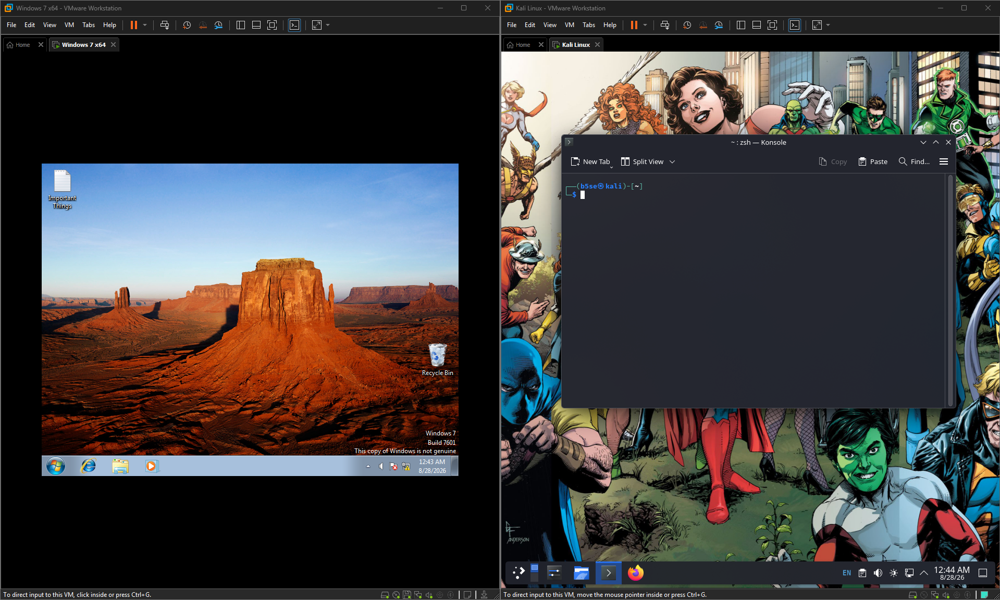

# Windows/Linux Penetration Testing Lab — EternalBlue

## Overview

I built an isolated cybersecurity lab using VMware Workstation Pro with a Kali Linux virtual machine and a deliberately vulnerable Windows virtual machine.

The purpose of the lab was to practice penetration-testing techniques in a controlled environment and apply tools and concepts I learned through TryHackMe.

All testing was performed against virtual machines that I created and controlled for educational purposes.

## Lab Environment

* VMware Workstation Pro
* Kali Linux
* Windows 7
* Isolated virtual network
* Metasploit Framework
* Meterpreter
* Nmap

The Windows virtual machine was intentionally selected and configured to be vulnerable to the EternalBlue vulnerability for educational testing.

## Methodology

### 1. Lab Setup

I created separate Kali Linux and Windows virtual machines in VMware Workstation Pro and connected them through a virtual network.

### 2. Reconnaissance

I identified the Windows VM's IP address using `ipconfig` and used basic network connectivity testing and Nmap to identify and investigate the target.

### 3. Vulnerability Identification

The Windows VM was intentionally selected because it contained a known vulnerability associated with EternalBlue. This allowed me to practice identifying and exploiting a known vulnerability within my own controlled environment.

### 4. Exploitation

Using Metasploit, I successfully exploited the vulnerable Windows VM from Kali Linux and established a Meterpreter session.

### 5. Post-Exploitation

After obtaining access, I used Meterpreter to explore the compromised system and practice basic post-exploitation functionality, including interacting with the Windows system and viewing the system remotely.

## Tools Used

| Tool                   | Purpose                                      |
| ---------------------- | -------------------------------------------- |
| Kali Linux             | Security testing environment                 |
| Nmap                   | Network reconnaissance and service discovery |
| Metasploit Framework   | Vulnerability exploitation                   |
| Meterpreter            | Post-exploitation interaction                |
| Ping                   | Basic network connectivity testing           |
| VMware Workstation Pro | Virtual lab environment                      |

## What I Learned

This project helped me understand how a basic penetration test can progress from reconnaissance to exploitation and post-exploitation.

I gained hands-on experience with:

* Virtual machine configuration
* Basic networking
* Network reconnaissance
* Nmap
* Metasploit
* Meterpreter
* Vulnerability exploitation
* Post-exploitation concepts
* Linux as a penetration-testing environment
* Windows system interaction

Most importantly, the lab allowed me to apply concepts learned through TryHackMe to a controlled environment that I built and managed myself.

## Disclaimer

This project was performed exclusively against virtual machines that I created and controlled for educational purposes. No third-party systems were targeted.

## Project Status

Completed
